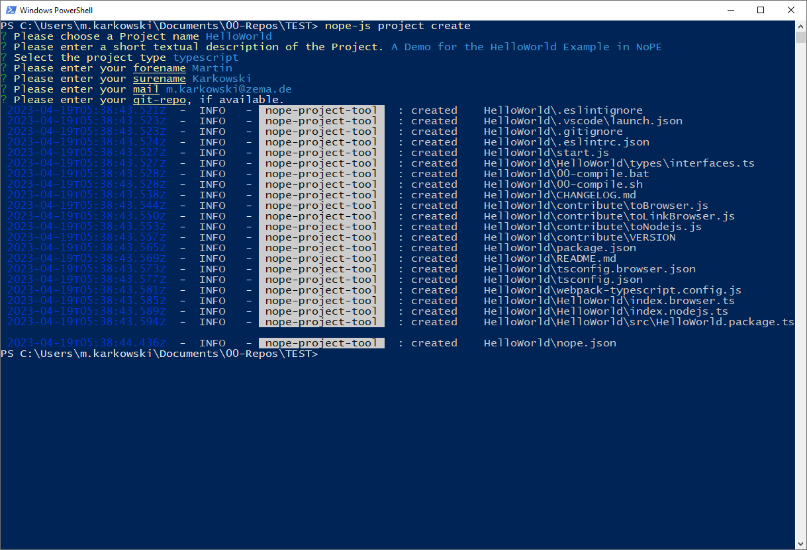
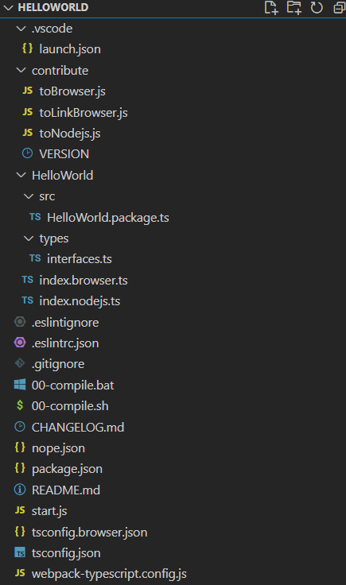
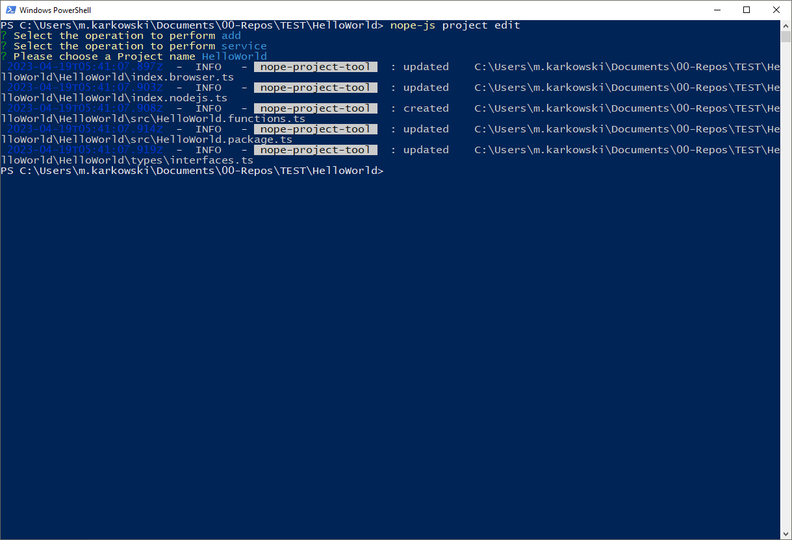
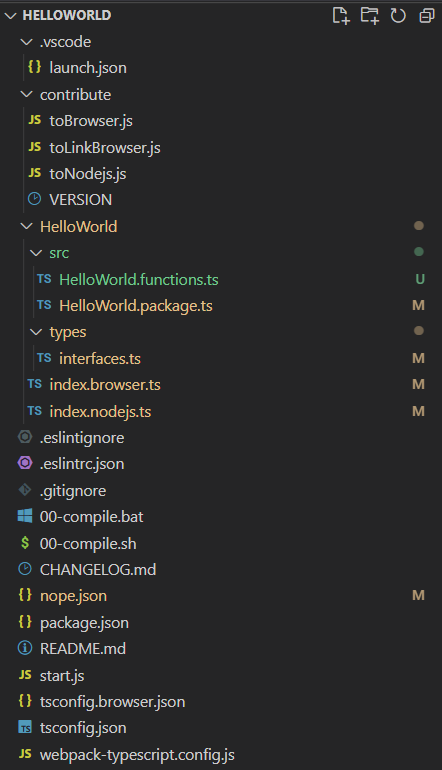
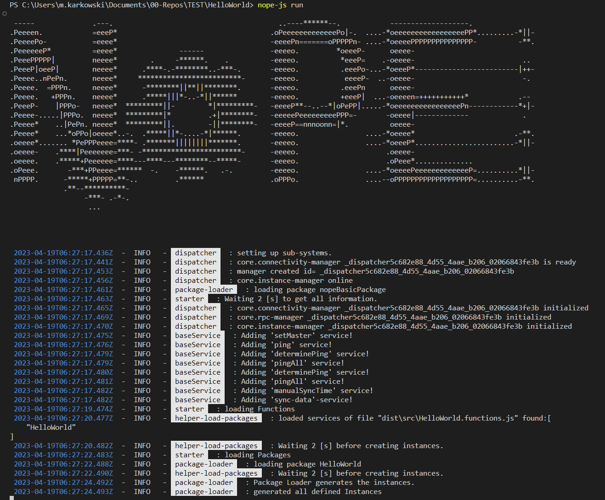
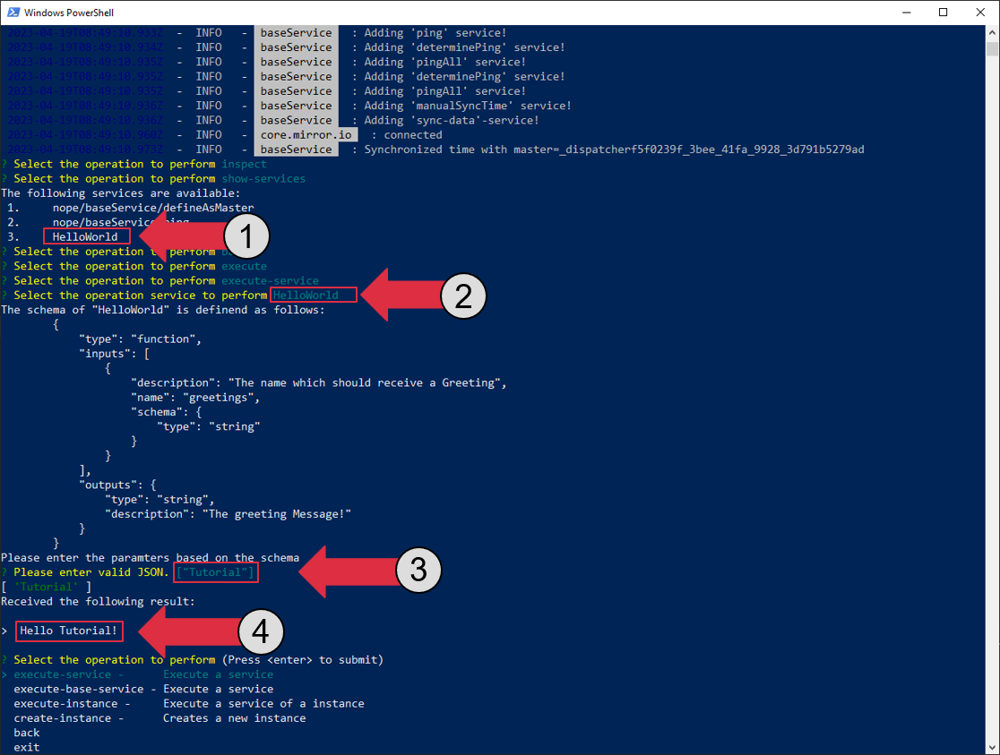

# No Programming Environment - `NoPE`

`NoPE` provides the basics for a distributed system. The `NoPE` basically links all modules to a system. It hides the distribution. The modules can run on multiple nodes (computation nodes) and `NoPE` takes care of coupling them, executing services and subscribing to events etc.

In Addtion, `NoPE` provides a basic concept for a front-end. This front-end will run on `next.js`.

Nope is availabel in multiple Programming-Languages:

- `nodejs`
- `python`

# Installation.

## Installing using Batch-File (Windows ONLY)

> This approach works on windows only.

To install `NoPE` just extecute the `00-install.bat`-Batch-File in the root-directory.

## Manual Installation

Make shure you run the following tasks

1. `npm install`
2. `./00-compile.bat` (on windows) or `./00-compile.sh` (on linux)
3. `./05-link.bat` (on windows) or `./05-link.sh` (on linux)

# Usage

## NoPE - Command Line Interface.

After installation you can use the following cli-tool:

> `nope-js`

Please select the option you want. Therefore add one of the following options:

- `help`      Show this help.
- `run`       Start a NoPE-Backend.
- `init`      Initialize a new project. This project is empty.
- `conf`      Trys to update the configuration file.    
- `scan-ui`   Scans and extracts the provided uis.  
- `upload-ui` Uploads the determined ui-file
- `service`   Generate Helper Files to provide services      
- `repl`      Opens an interactive console.      

# Changelog

Checkout our [changelog](./CHANGELOG.md).


# `NoPE` in 5 min

## 1. Create a `Nodejs` Project


Get started by **creating a new project** distributed using `NoPE`.

1. Installation using  npm:
  ```bash
  npm install -g nope-js-node
  ```
2. Start your first Project:
  ```bash
  nope-js project create
  ```
  This should open a `cli` like that:

  

3. Answer the requried questions to complete create the directory.
  - Name the project `HelloWorld`
  - Give it a short summary. This summary will used during distributing your project.
  - make shure you select `typescript` as project type  
  

4. navigate to the create folder ( e.g. `cd ./HelloWorld` ) 

  This creates the following folder structure:

  

5. Open your IDE (e.g. vscode)

By using the project-tool the following features are added to the project:
- Debugging of the application using VS code (launch-file)
- Creation of a doc file (see doc/make)
- Helpers to build a browser related version
- Defined Project Structure (using interfaces etc.)
- Use of a changelog
- Deployment as a package
- Simple extension using project-tool

## 2. Add a Service in `Typescript`

Our goal is to define a greeting service
> The service creates a greeting message for a person. 

### Why a Service

> This service is independent of how many times it has been called.
> Our functionality is stateless, this allows us to use a service.

### Using the `CLI` to generate the Service

1. To create the Service: 
  use the `project-tool` to create the service 

  ```bash
  nope-js project edit
  ```

  

2. Perfom the following selection inside of the tool.
  1. Selection `add`, to add a new element
  2. Select `service`, because we want to create a service
  3. Enter the name of the service, in our case `HelloWorld`
  
  Creation of the corresponding files and imports is done automatically

  This will update our files in the Folder:

  

Now `NoPE` defined a new service file (`HelloWorld.functions.ts`) for us:

```typescript
import { HelloWorldService } from "../types/interfaces";
import { exportAsNopeService, getNopeLogger } from "nope-js-node";

const logger = getNopeLogger("HelloWorld-service")

// Here is our main implementation we need to change
export async function _HelloWorldService (greetings: string) {
    // Please overwrite me.
    logger.debug("calling service 'HelloWorld' with the following parameters:", greetings)
    return "Hello " + greetings + "!"
}

// The exported Service.
export const HelloWorld: HelloWorldService =  exportAsNopeService(_HelloWorldService, {
    id: "HelloWorld",
    schema: {},
});

```

In that file, you will find a template for the service we want to implement. By default, the newly created service implements the hello-world behavior. This must changed. In our case it matches the desired behavior.


> All services **must** be implemented `async` manner. This is necessary so that the runtime is not blocked.


### Adding a Service interface

We now want to describe our service, that it can be used correctly at different Runtimes. Therefore we will add an `schema` to the ***exported*** service. This Schema follows the definition of a `JSON-Schema`:

```typescript
export const HelloWorld: HelloWorldService =  exportAsNopeService(_HelloWorldService, {
    id: "HelloWorld",

    // We describe our interface as follows:

    schema: {

        // Enhanced Type of the JSON-Schema. We added the type: "function" for this purpose
        type: "function",
        
        // To describe the used inputs of a function or serive we added the field "inputs" to the schema.
        // It contains a list of all required inputs.
        inputs: [
            {
                // The Description of the Parameter
                description: "The name which should receive a Greeting",
                // Its used name in the function (see the arguments of the function)
                name: "greetings",
                // The Schema follows a default JSON-Schema
                schema: {
                    type: "string"
                }
            }
        ],

        // To describe the return of a function we added the field "outputs". It contains a 
        // JSON-Schema Object.
        outputs:{
            type: "string",

            // We provide some extra Info for the other users.
            description: "The greeting Message!"
        }
    },
});
```

Luckily, `Typescript` will help us during this process due to the typing system of `Typescript`.

## 3. Running the Service:

Before we are able to execute our service we have to `compile` our code to pure `javascript`. 

1. Make shure you installed all dependencies (This has only to be performed once):
  ```bash
  npm install
  ```

2. Compile your code:
  ```bash
  ./00-compile.sh
  ```

  This will compile the `Typescript` files to pure `javascript`. Additionally the Files will be compiled to a specific browser version.

To run the `service` and distribute to different `NoPE`-Runtimes we have to determine a configuration:

```bash
nope-js conf -d dist
```
The `cli` will find all defined `services` or `modules` exposed in a so called `NoPE-Package` (This has been created automatically during the initalization of the project). The tool will store its results in the following configuration (located at `./config/config.json`):

```json
{
    // Our toool fund the following functions:
    "functions": [
        {
            "path": "dist\\src\\HelloWorld.functions.js",
            "functions": []
        }
    ],

    // Additionally the tool found our `HelloWorld` Project as "module"
    "packages": [
        {
            "nameOfPackage": "HelloWorld",
            "defaultInstances": [],
            "autostart": {},
            "path": "dist\\src\\HelloWorld.package.js"
        }
    ]
}
```

Finally we are ready to distribute our service by using the command:

```bash
nope-js run
```

This should produce the following output.



## 4. Interact with the Runtime

Currently our service is only run internally (nope is not connected and runs without an external connection layer). To check and play with the distribution, we kill our old process (`ctrl+c`) create a separate process (e.g. a bash) and provide a serve:

```bash
nope-js run -c io-server
```

This will spool up a `socket-io` server on our localhost. 

Afterwards we will restart our Runtime hosting the created service using `io-sockets` as connection layer:

```bash
nope-js run -c io-client
```

Now we are able to start our `interact-tool` to manually execute our process:

```bash
nope-js interact -c io-client -s
```

To use the `interact`-**tool** follow the questions:

1. What do you want to do?
    - We want to inspect our distributed system -> `inspect`
2. What do you want to inspect?
    - We want to check if our service is present -> `service`
    - We should be albe to see our `HelloWorld`-Service (see 1)
3. Now we want to execute this service. Therefore we navigate `back` to the main menu
4. Now we select `execute` and afterwards `service` because we want to execute our service
5. Now the Tool renders the available services and we select `HelloWorld` (see 2) and it will render the previously defined Schema.
6. Now we have to enter the inputs required by the Service:
    - It is important that the parameters are entered as list (because there might be more the 1 Parameter)
    - Enter the parameters as valid `JSON` Data.
    - Press `enter`

    > Executing services with the interact tool will perfom function immedialty. If you integrated Hardware be aware of that.


7. The Tool shows the result (see 4)




> You are now running a distributed System using **remote procedure calls**

