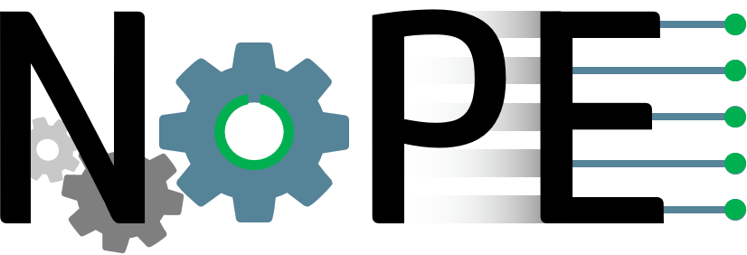

# No Programming Environment - `NoPE`

`NoPE` provides the basics for a distributed system. The `NoPE` basically links all modules to a system. It hides the distribution. The modules can run on multiple nodes (computation nodes) and `NoPE` takes care of coupling them, executing services and subscribing to events etc.

In Addtion, `NoPE` provides a basic concept for a front-end. This front-end will run on `next.js`.

Nope is availabel in multiple Programming-Languages:

- `nodejs`
- `python`

# Installation.

## Installing using Batch-File (Windows ONLY)

> This approach works on windows only.

To install `NoPE` just extecute the `00-install.bat`-Batch-File in the root-directory.

## Manual Installation

Make shure you run the following tasks

1. `npm install`
2. `./00-compile.bat` (on windows) or `./00-compile.sh` (on linux)
3. `./05-link.bat` (on windows) or `./05-link.sh` (on linux)

# Usage

## NoPE - Command Line Interface.

After installation you can use the following cli-tool:

> `nope-js`

Please select the option you want. Therefore add one of the following options:

- `help`      Show this help.
- `run`       Start a NoPE-Backend.
- `init`      Initialize a new project. This project is empty.
- `conf`      Trys to update the configuration file.    
- `scan-ui`   Scans and extracts the provided uis.  
- `upload-ui` Uploads the determined ui-file
- `service`   Generate Helper Files to provide services      
- `repl`      Opens an interactive console.      

# Changelog

Checkout our [changelog](./CHANGELOG.md).
