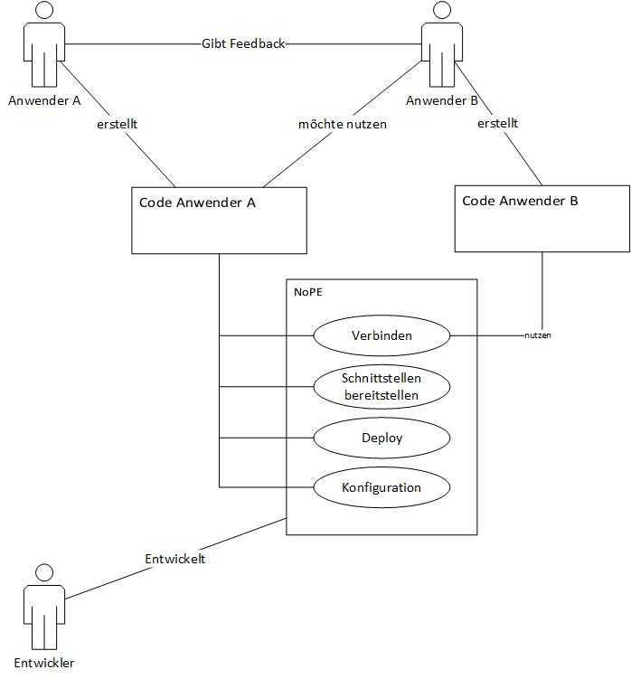
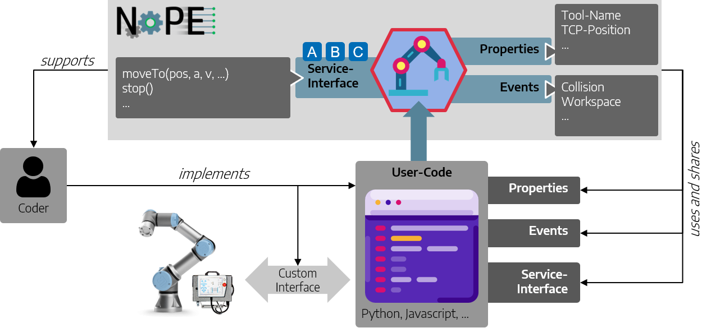
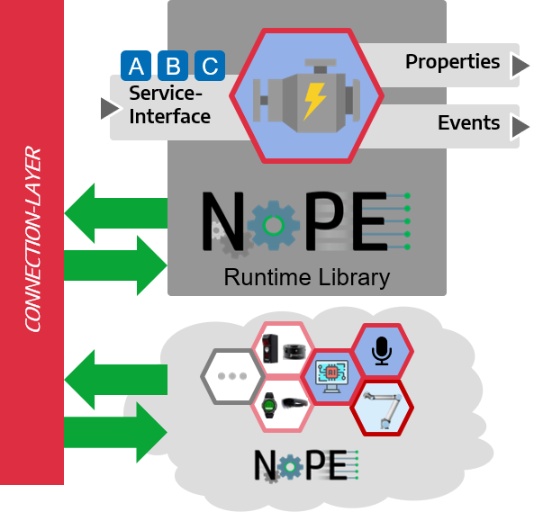
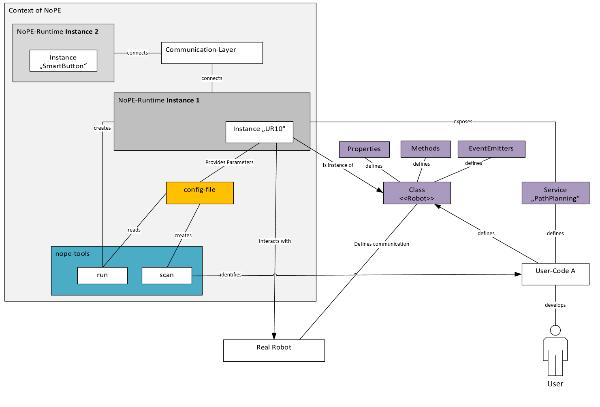
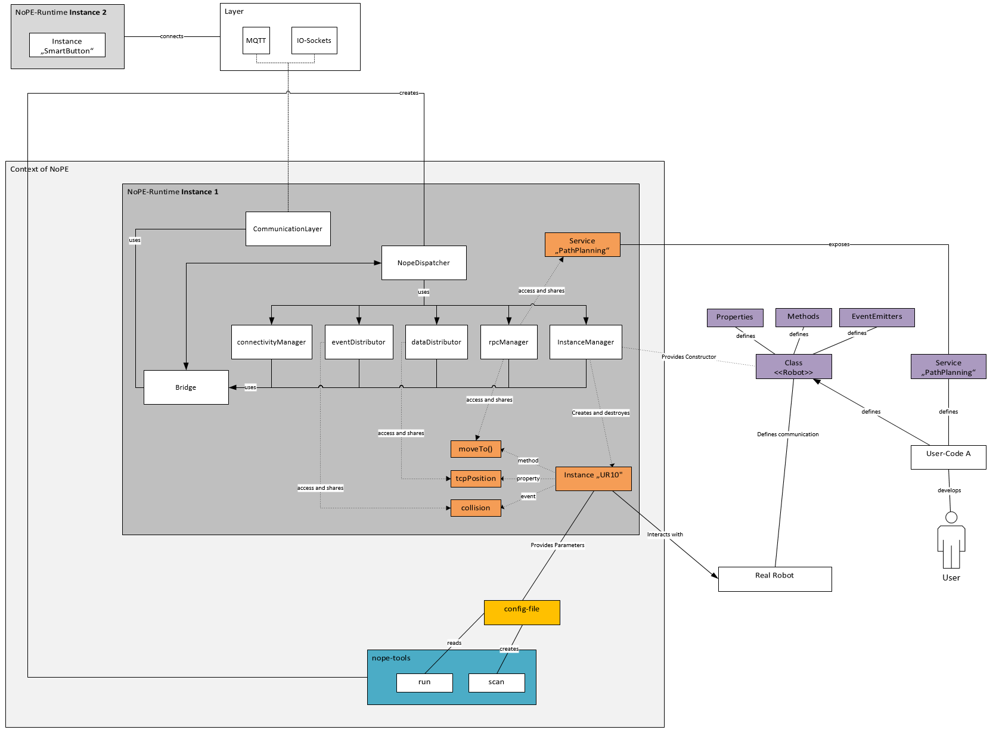
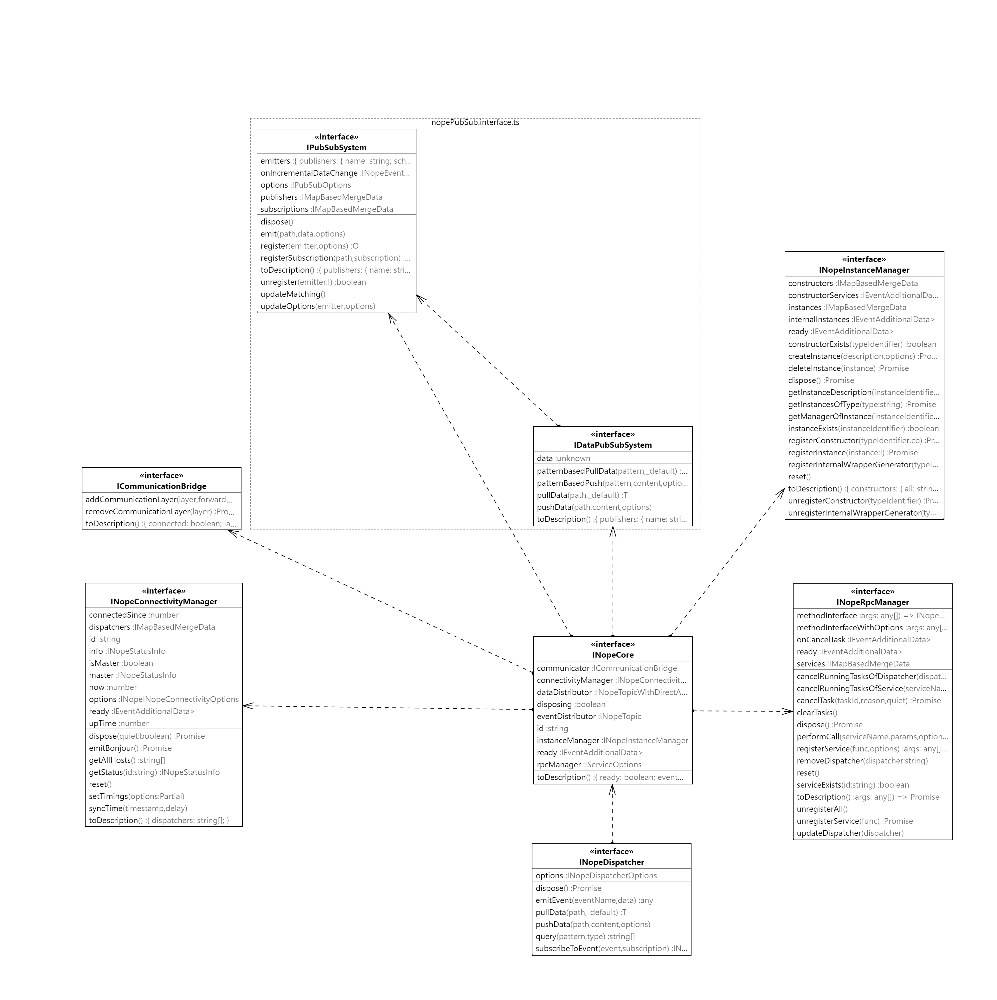
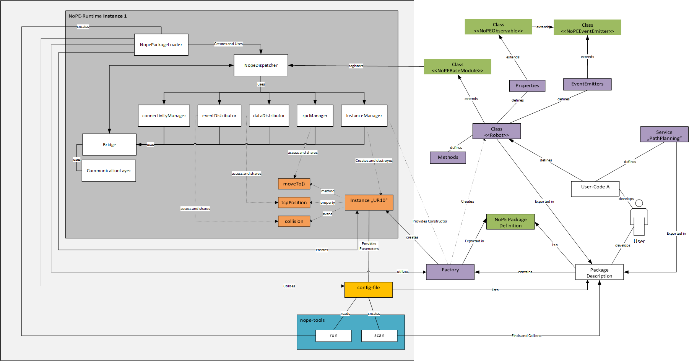

Diese Dokumentation basiert auf dem ARC42-Template. Für mehr Details schauen Sie Hier: https://www.arc42.de/overview/

# Einführung und Ziele

> Beschreibt die wesentlichen Anforderungen und treibenden Kräfte, die bei der Umsetzung der Softwarearchitektur und Entwicklung des Systems berücksichtigt werden müssen:

## Aufgabenstellung von `NoPE`

`NoPE` soll im Wesentlichen die Implementierung von verteilten Softwaresystemen vereinfachen. Im Kontext von `MSys` gehören dazu  alle einzelnen Teilsoftwarekomponenten (bspw. Wrapper für einen Roboter, Greifer oder Laser-Liniensensor oder Softwarekomponenten), die erforderlich sind um das Verhalten des Systems abzubilden.



`NoPE` verfolgt dabei u.a. folgende Ziele und Aufgaben stellen:

- Schaffen einer einheitlichen Kommunikationsstruktur damit einzelne Software-Komponenten mit einander Kommunizieren können.
- Grundlage mit denen Teilsysteme miteinander Verknüpft werden können.
- Durch `NoPE` sollen Software-Komponenten wiederverwendbarer werden und nicht jedes mal erneut erstellt werden müssen. 
- Der Anwender soll möglichst nicht durch die Konzepte von `NoPE` beeinflusst werden, viel mehr soll `NoPE` als Arbeitserleichterung verstanden werden.


### Fachliche Aufgabenstellung von `NoPE`

> Das `Prinzip "Rossmann"` soll ermöglicht werden

Mit dem `Prinzip "Rossmann"` sollen langfristig Mitarbeiter, verschiedene Teillösungen entwicklen, die Kompatibel zu einer Basis sind. D.h. die Softwarekomponenten des `WiMi A` können durch `WiMi B` verwendet und erweitert werden. (Damit soll verhindert werden, dass alle MA keinen Absprungpunkt für die Software und Methodenentwicklung haben.) Dazu müssen verschiedene Pattern implementiert werden. Das System soll dabei insbesondere den Kommunikationsoverhead reduzieren und einen interen Standard für die Kommunikation mit weiteren Modulen ermöglichen.

Dazu soll eine grundlegende Basis Software / Library entstehen, mit denen die Kommunikation zwischen verschiedenen Modulen abgebildet werden kann. Dabei soll die Struktur der Software in einer gewissen Form standardisiert werden (bspw. über Standardklassen und methoden), damit eine Übergabe vereinfacht werden kann und sich die MA nur noch um die Implementierung der Logik kümmern müssen. Es wird von den MA demnach keine eigenständige Einbindung bspw. von `REST` oder `mqtt` benötigt, um mit den Modulen von anderen MAs zu interagieren. Ferner soll `NoPE` dabei eine *Verteilung* der Software (bspw. auf Server, IPCs etc) ermöglichen. Damit sollen bspw. ML-Lösungen in Python auf einem Server implementiert werden können diese in eine javascript basierten Oberfläche eines Browser verwendet werden können.

### Treibende Kräfte von `NoPE`

Bei der Entwicklung sind bisher folgende Treibendekräfte identifiziert worden:

- **Motivator**: Stellt sicher, dass die Software eine Anwendung findet
    - Rainer Müller (Treiber `Prinzip Rossmann`)
- **Entwickler**: Stellt sicher, dass die unten genannten Anforderungen in Form der Software umgesetzt werden
    - Martin Karkowski (Kernentwickler)
- **Anwender**: Verwendet die Software in seiner eigenen Software und liefter Kenntnisse und Optimierungspotentiale. Bisher: 
    - Dominik Kuhn
    - Niklas Foth

### Anforderungen an `NoPE`:

Durch `NoPE` sollen folgende funktionale Anforderungen erfüllt werden:
- Damit alle `NoPE` verwenden können, soll eine einfacher Aufbau verwendet werden.
- Alle relevanten Pattern (pub-sub, request and response) sollen über `NoPE` implementiert werden können. 
- Der Anwender soll sich nicht um die Kommunikation kümmern, sondern auf die Implementierung seiner Software-Komponente konzentrieren
- Der Anwender soll Programmiersprachen unabhägig die Module verwenden können.
- `NoPE` soll so flexibel gestaltet werden, dass in der zukunft weitere Architekturen darauf aufgebaut werden können (bspw. Blackboard etc)

Eine detaillierte Auflisten der Anfoderungen ist in der [Anforderungsliste](./00-Requirements.md) gegeben

> „Erfordernis oder Erwartung, das oder die festlegt, üblicherweise vorausgesetzt oder verpflichtend ist“ Quelle: ISO 9000:2015 (3.6.4)


### Motivation für die Entwicklung von `NoPE`

> Aus Sicht der späteren Nutzung ist die Unterstützung einer fachlichen Aufgabe oder Verbesserung der Qualität der eigentliche Beweggrund, ein neues System zu schaffen oder ein bestehendes zu modifizieren.

- Implementierung `Prinzip Rossmann`
- Doppelung von Softwareentwicklung vermeiden
- Softwarekompatibilität soll ermöglicht werden


## Qualitätsziele von `NoPE`

Die Top-3 der Qualitätsanforderungen für die Architektur, deren Erfüllung oder Einhaltung den maßgeblichen Stakeholdern besonders
wichtig sind sind: 

1. **Functional Suitablity**
    
    *Motivation*: Das System soll den Anforderungen gerecht werden, damit das System genutzt werden kann und dies durch die Anwender gewollt ist.
2. **Operability**

    *Motivation*: Die Anwendung soll verschiedene Forschungsthemen verschmelzen indem einzelne Softwarekomponenten (von verschiedenen Anwendern erstellt) benutzt werden können. Dies soll langfristig zu einer Änderung der Kultur führen. Die software-komponenten sollen damit einhergehend besser getest, universeller und vielseitig anwendbar werden.
3. **Transferablitiy**

    *Motivation*: Das System soll in unterschiedlichen Anwendungsfällen anwendbar sein. Damit soll eine Langfristige Kompatibilität der von den Anwendern geschriebene Software sichergestellt werden.

Gemeint sind hier wirklich Qualitätsziele, die nicht unbedingt mit den Zielen des Projekts übereinstimmen. Beachten Sie den
Unterschied. Hier ein Überblick über die Definitionen basierend auf dem ISO 25010 Standard für die verwendeten Begriffe:


## Stakeholder bei `NoPE`

Angedachte Stakeholder sind in diesem Kontext die Wissenschaftlichen Mitarbeiter und deren Hiwis, die verschiedene Teilkomponenten erstellen. Die angenomme Erwartungshaltung definiert sich wie folgt:
- leichte Anwendbarkeit
- Kaum / Keine Beeinträchtigung bei der Anwendung
- Kein Einfluss bei der Performance.
- Fehlerfrei
- einfache Installation


Eine genaure Übersicht ist in der nachfolgenden Tabelle mit Rollen- oder Personennamen, sowie deren Erwartungshaltung
bezüglich der Architektur, deren Dokumentation und `NoPE` gegeben.

| Rolle        | Kontakt        | Erwartungshaltung | Motivation |
|--------------|----------------|-------------------|----|
| *Name der Rolle* | *Beispielhafter Ansprechpartner* | *Beschreibt die Erwartunghaltung* | *Sie sollten die Projektbeteiligten und -betroffenen kennen, <br> sonst erleben Sie später im Entwicklungsprozess Überraschungen.<br>Diese Stakeholder bestimmen unter anderem Umfang und <br>Detaillierungsgrad der von Ihnen zu leistenden Arbeit und Ergebnisse.* |
| ***Motivator*** | bspw. *Rainer Müller* | - Setzt Anwendung durch <br>- Bewertet nutzen <br>- Bewertet nutzen  | - Möchte doppelte Softwareentwicklung vermeiden <br>- Möchte, dass alle Softwarekomponenten kompatibel sind  | 
| ***Entwickler*** | bspw. *Martin Karkowski* | - Tiefes Systemverständnis <br>- Pflege und Sicherstellung der Korrektheit der Software <br>- Implementiert Softwaretests <br>- Implementierung von Erweiterungen  <br>- Dokumentation wird gelesen und erhält dadurch feedback | - Möchte den Implementierungsprozess vereinfachen <br>- Möchte, dass andere Softwareelemente einach verwendet werden können <br>- Programmiert gerne <br>- Möchte standards etablieren |
| ***Anwender*** | bspw. *Dominik Kuhn* | - Verständnis über Funktionalität, <br>- Kennt die Dokumentation und Schnittstellen <br>- Programmierkenntnisse in bspw. python oder javascript <br>- Kenntnisse im Bereich **Objektorientierte Programmierung** <br>- Verständnis über das Pattern Publish and Subscribe <br>- Kenntnisse im Bereich **Asynchrone Programmierung** <br>- Meldet Wünsche und erforderliche Erweiterungen <br>- Liefert relevantes Feedback zur Weiterentwicklung und Optimierung  | <br>- Möchte nur die Logik implementieren <br>- Möchte Software von anderen Anwendern verwenden <br>- Möchte schnell zum Zielkommen

Expliziter Überblick über die Stakeholder des Systems – über alle
Personen, Rollen oder Organisationen –, die

-   die Architektur kennen sollten oder:
    - **Anwender** (Softwareentwickler in der Gruppe Msys oder weiteren Projekten):
        - Hiwis
        - Wimis
        - GL        

-   von der Architektur überzeugt werden müssen,
    - **Anwender** (Softwareentwickler in der Gruppe Msys oder weiteren Projekten)
    - **Motivator**?

-   mit der Architektur oder dem Code arbeiten (z.B. Schnittstellen
    nutzen),
    - **Anwender** (Softwareentwickler in der Gruppe Msys oder weiteren Projekten)

-   die Dokumentation der Architektur für ihre eigene Arbeit benötigen:
    - **Anwender** (Softwareentwickler in der Gruppe Msys oder weiteren Projekten)

-   Entscheidungen über das System und dessen Entwicklung treffen
    - **Anwender** (Softwareentwickler in der Gruppe Msys oder weiteren Projekten)


# Randbedingungen bei der Entwicklung von `NoPE`

Folgende Randbedingugnen wurden bei der Entwicklung von `NoPE` identifiziert:
- Im Bereich Msys werden vorallem Prototypen entwickelt. Daher ist die Entwicklungsgeschwindigkeit extrem wichtig. Daher wird folgende Rahmenbedingung getroffen: 
    > Im entwicklungsschritt erfolgt i.d.R. zunächst die schnelle Entwicklung eines Lauffähigen Prototypens, die Schnittestellen werden erst im Anschluss fixiert. Daher sollte dieser Entwicklungsprozess / diese Vorgehensweise im System abbildbar bleiben. (Anderns als bei bspw. `gRPC`, bei dem zunächst die Schnittstellen definiert werden folgt hier der Ansatz: `Logic first`)
- Die Anwender sind keine professionellen Programmierer. Dies hat folgende Auswirkungen:
    - eine einfache Anwendung ist extrem wichtig
    - komplizierte Konstrukte (hierzu zählen bspw. `async` Programmierung sind zu vermeiden, oder so einfach durch Helfer wie möglich zu gestalten)
    - Der Anwender hat keine Ahnnung von *Multithreading* etc.
- Eine Verbreitung muss aktiv getrieben werden,  da die Einarbeitung zunächst einen zusätzlichen Aufwand für die Mitarbeiter darstellt, da diese teilweise stark im Tages und Projektgeschäft eingebunden sind. Auswirkung:
    - Die Einführung ist kein selbstläufer,
    - Durch die Unsicherheit bzgl. Verbreitung von `NoPE` innerhalb des ZeMAs müssen die Module auch ohne `NoPE` funktionsfähig bleiben
    - Der Integrationsaufwand von `NoPE` muss minimal gestaltet werden.
    - Alle Hürden sind so gering wie möglich zu gestalten. (bspw. einfache Verwendung, Dateibasiertes Konfigurationsprinpzip, etc.)
- Bis dato kann keine Veröffentlichung der Aktivitäten auf `github.com` oder `npm` / `pip` erfolgen, da das System noch nicht offizell freigegeben wurde.
    - Einfache `batch`-dateien zur Installation sind erforderlich. 
    - Intern kann die Software über `docker`, der internen npm und pip verwaltung geteilt werden. Diese Punkte müssen jedoch aktiv dokumentiert werden!
- Das Msys-Team hat sich auf die Einschränkung verschiedener Programmiersprachen verständig (backend = python, frontend = javascript).
    - Die Sprachen (python und javascript) mit dem System kompatibel sein.
    - Da diese Sprachen dynamisch sind, kann auch die Umgebung dynamisch sein.
- lauffähig auf unterschiedlichen Systemen (Linux, Windows, Browser), da bei der Anwendungsentwicklung am ZeMA verschiedene Umgebungen verwendet werden
- Die lauffähigkeit muss auf x86 Systemen gegeben sein. d.h.:
    - Embedded Syteme werden vernachlässigt
    - SPS werden vernachlässigt.
- Es wird eine einheitliche Namens-Konvention verwendet. Hier: `camelCase`   

    


# Kontextabgrenzung

<div class="formalpara-title">

**Inhalt**

</div>

> Die Kontextabgrenzung grenzt das System gegen alle Kommunikationspartner (Nachbarsysteme und Benutzerrollen) ab. Sie legt damit die externen Schnittstellen fest und zeigt damit auch die Verantwortlichkeit (scope) des Systems: Welche Verantwortung trägt das System und welche Verantwortung übernehmen die Nachbarsysteme?

Damit diese Frage beantwortet werden kann soll folgendes Beispiel erleutert werden:

Ein **Roboter** soll durch einen **Smart-Button** kontrolliert werden können. Ziel ist es beim drücken des Smart-Buttons den Roboter zu einer definierten Position fahren zu lassen. Im Kontext der Herangehensweise der Msys-Gruppe sollen für die einzelnen Komponenten "Roboter" und "Smart-Button" entsprechende widerverwendbare Module erstellt werden.

Dabei kann der **Kontext** wie folgt dargestellt werden:
- Der Anwender implementiert den spezifischen `Code` zur Ansteuerung des Roboters. Dies kann er in `python` oder `javascript` machen. Dabei implementiert er ein spezielles interface um mit der Roboter-Steuerung zu kommunizieren (bspw. TCP-IP basiert, durch den Hersteller vorgegeben).
- Der Anwender implementiert einen Wrapper für den Smartbutton.
- `NoPE` unterstützt den Anwender dabei, indem verschiedene Basisklassen und Funktionalitäten (Kommunikation, Verteilung, Event-Messaging, etc.) bereitgestellt werden.
    - Dazu muss der Anwender verschiedene Methoden aufrufen, damit `NoPE` die entsprechenden `Eigenschaften`, `Event-Emitter` oder `Services` für andere Systeme bereitstellen kann.
- `NoPE` implementiert dabei nicht die spezielle Logik, die erforderlich ist, um den realen Roboter anzusteuern.
- `NoPE` stellt in diesem Zusammenhang keine speziellen Container, Virtuelle Maschinen, Netzwerkverbindungen oder Hardware bereit.

Dies wird in der unten stehenden Abbildung verdeutlicht




## Business - Kontext:
- `NoPE` stellt nur eine Implementierungshilfe (insbesondere bzgl. Konnektivität und Verteilung) dar.
- Die Logik des oben genannten Anwendungsfalls sowohl für die Wrapper, als auch für die zentrale Steuerungslogik wird von (ggf. unterschiedlichen) Anwendern in einer Objekt-Orientierten herangeehensweise implementiert.


## Fachlicher Kontext

`NoPE` dient zur Sicherstellung der Konnektivität der einzelnen Teilkomponenten. Dazu wird ein standardisiertes Kommunikations-Layer verwendet. Damit wird die erforderliche technische Kommunikation (bspw. RPC-Aufrufe, Event-Forwarding, Data-Propagation) zwischen den Modulen ermöglicht. Vereinfacht soll dieser Zusammenhang in der nachfolgenden Abbildung verdeutlicht werden. 



Fachlich kann folgende Kontexteingrenzung getroffen werden:
- `NoPE` stellt ein Konzept zur Konfiguration bereit: 

    > Es wird eine standardieserte *Konfigurationsdatei* (als `JSON`) erstellt. Diese kann in einer IDE angepasst werden

- `NoPE` stellt ein Konzept zur Kommunikation und Messagehandeling dar
    - Dabei werden folgende Nachrichtenformate definiert:
        - Infos über die Runtime (bspw. bereitgestellte Daten, Ereignisse, Services, Instanzen und Klassen-Konstrukturen).
        - Infos über Services (Parameter und deren Typen, Funktionaliät als textutelle Beschreibung, Rückgabewerte)
        - Infos über Instanzen (Methoden, Attribute und Event-Emitter)
        - Nachrichten zur Durchführung von Datenänderungen, Remote-Procedure-Calls, Statusmeldungen (siehe Infos)
        - ...
    - Werden Kommunikations-layer verwendet, die einen `Broker` benötigten (bspw. `MQTT`) werden diese **nicht** von `NoPE` bereitgestellt.
- `NoPE` stellt folgendene Konsolen basierte Tools zu Verfügung:
    - dyanmsichen Interaktion mit der Laufzeit-Umgebung bereit,
    - Erstellen einer Laufzeitumgebung (`run`)
    - Erstellen von Konfigurationsdateien (`scan`)
    - Implementierung der Konfiguration als `windows` oder `linux` services.
- Standardklassen etc.
- Konzepte zur Beschreibung von Daten (hier `JSON-Schemas`)


# Lösungsstrategie

Es folgt ein kurzer Überblick über die grundlegenden Entscheidungen und
Lösungsansätze, die Entwurf und Implementierung des Systems prägen.
Hierzu gehören:

-   Technologieentscheidungen:
    - Es wird ein **Objektorientierter Ansatz** verfolgt
    - Eine Implementierung erfolgt in dynamischen Programmiersprachen (`Typescript`/`Javascript` und `Python`)
        - Die `Typescript`-Variante wird zu Javascript compiliert
        - Die `Javascript`-Library wird sowohl für den Browser, als auch für Nodejs bereitgestellt. Dabei unterscheiden sich die Varianten, da verschiedene Funktionalitäten (bspw. Filesystem-Zugriffe nicht im Browser implementiert werden können)
        - Die Browser-Variante wird als ES-Modul angeboten
    - Es wird ein `event`-basierter Ansatz verwendet.
    - `NoPE` wird als Package bereitgestellt.
    - Als standard Daten-Konvention wird das `JSON` Schema verwendet.
    - Es muss auf standard-protokolle für die Kommunikation gesetzt werden
    - Es wird eine Plugin-System verwendet, welches eine einfache Erweiterung des System erlaubt. Dabei können beliebige Klassen und Funktionen durch das System überschrieben werden. Das Plugin System kann auch ohne NoPE verwendet werden.
-   Entscheidungen über die Top-Level-Zerlegung des Systems:
    - Es wird das SOLID-Prinzip zur aufteilung des Codes verwendet.
    - Die genaue Aufteilung erfolgt in `Bausteinsicht`.
-   relevante organisatorische Entscheidungen, beispielsweise für
    bestimmte Entwicklungsprozesse oder Delegation bestimmter Aufgaben
    an andere Stakeholder.

# Bausteinsicht

## Whitebox `NoPE`



Damit alle Anforderungen an `NoPE` erfüllt werden können, spannt das System verschiedene sog. `runtimes` auf (diese werden durch das commandline-interface `run` gestartet). Dieses stellt den definierten User-Code für andere `runtimes` bereit. Dazu wird eine Konfigurationsdatei als Grundlage verwendet. Diese beschreibt, welche elemente (Klassen, Instanzen und Services) in die Runtime geladen werden sollen. Über ein sog. `connection-layer` können dann verschiedene Runtimes verbunden werden. Für den Anwender ist es dabei egal, ob das gesamte System auf verschiedenen Runtimes ausgeführt wird oder nur eine Runtime verwendet wird. 

Damit kann zusammenfassend gesagt werden, dass `NoPE` insbesondere eine vernetzte Laufzeitumgebung (`Runtime`) bereitstellt, die alle Anfoderungen an die Konnektivität erfüllt. 

## Kernelemente einer Laufzeit

Damit die Funktionalitäten durch NoPE in einer Laufzeitumgebung implementiert werden können, verwendet das System als Zentrales Element einen sog. `NoPE-Dispatcher`.

Der NoPE-Dispatcher ist als Schicht zwischen den verschiedenen Modulen / Dispatchern konzipiert. Sie ermöglichen verteiltes Rechnen oder einfach eine einfache Service-orientierte Architektur (SOA). Ein Dispatcher wird verwendet, um die Module zu verbinden, Daten und Ereignisse gemeinsam zu nutzen und eine Remote Procedure Call (rpc) Schnittstelle bereitzustellen.

## Black-Boxes des Dispatchers:

Gemäß des **SOLID** Prinzips, verwendet der Dispatcher folgende Komponenten. Diese haben die nachfolgende Verantwortlichkeit.

| Element | Beschreibung und Verantwortlichkeit |
|-|-|
| `connectivityManager` | stellt eine Verbindung zu anderen Dispatchern her und verwaltet den Status der anderen Dispatcher. Er überprüft ihren Zustand und entfernt tote Dispatcher (`tot` = keine Verbindung ist aktiv). Er detektiert neue Dispatcher. |
| `eventDistributor` | verteilt Ereignisse über das Netzwerk (oder intern). Sie können dieses Element verwenden, um auf bestimmte Ereignisse zu warten. Die Subskription dieser Ereignisse erlaubt `mqtt`-Patterns. Zusätzlich können Sie Ereignisse zu bestimmten Themen oder musterbasierten Themen ausgeben |
| `dataDistributor` | gibt Daten über das Netzwerk (oder intern) weiter. Im Gegensatz zu Ereignissen sind die Daten persistent und jederzeit verfügbar. Sie können dieses Submodul verwenden, um auf bestimmte Datenänderungen zu warten (Datenhaken installieren), bestimmte Daten zu ziehen oder Daten zu pushen. Sie können Daten mit einem auf `mqtt`-Mustern basierenden Pfad abrufen / pushen. |
| `rpcManager` | Wird verwendet, um `Remote Procedure Calls` durchzuführen (siehe [hier](https://de.wikipedia.org/wiki/Remote_Procedure_Call)). Der Manager behält den Überblick über die verfügbaren Dienste. Das Untermodul registrieren bzw. entfernt (neue) Dienste. |
| `instanceManager` | Wird verwendet, um (entfernte) Instanzen zu erstellen/zu entfernen. Der Manager behält den Überblick über die verfügbaren Instanzen im Netzwerk und erlaubt es, `Wrapper` für diese Instanzen zu erstellen. Damit kann der Zugriff vereinfacht werden. Um es dem System zu ermöglichen, neue Instanzen eines bestimmten Typs bereitzustellen, können Constructoren als `Service` angeboten werden. |

Damit eine Einordnung der Zusammehang und Verantwortlichkeiten der Blackboxen erfolgen kann ist in der Nachfolgenden Grafik, der Use-Case detaillierter dargestellt. Dabei werden die einzelnen Elemente mit den relevaten teilen verbunden. 



Wie in der Grafik zu sehen ist, werden auch `Instanz`-basierte Events, Daten und Services über die Standardelemente eines Dispatchers innerhalb des Netzwerk verteilt und bereitgestellt. D.h. wenn eine Instanz in `NoPE` definiert wurde, werden alle Events, Properties und Methoden über die Standardelemente des Dispatchers verteilt und weiteren Elementen zu Verfügung gestellt. Damit dies insbesondere bei Instanzen erfolgen kann wird bei dieses der Zugriff dabei in sog. `Wrappern` vereinfacht. Diese stellen dein standardisertes Interface (wie die original Klasse) zu verfügung. Damit ist für den Anwender in der Praxis egal, ob er mit einer Instanz in einer anderen Laufzeitumgebung interagiert oder, ob diese direkt in der selben Laufzeitumgebung läuft. 

## Whitebox `NoPE-Dispatcher`

Nachfolgend ist eine Übersicht eines Dispatchers als Zentrales Element von NoPE als Klassendiagramm gegeben. Diese beschreibt die Zusammenhänge der einzelnen Elemente des `Dispatchers`:



-----

### 1. `CommunicationLayer` 


Eine Layer ist ein Element, welches zum Herstellen einer Kommunikationsverbindung verwendet wird. Dieses Element implementiert den Verbindungsaufbau kontrekt (bspw. MQTT-Layer). 

Ein Layer hat folgende Funktionalitäten, die durch ihr interface bereitgestellt werden:

- Der Layer muss die Methoden `on` implementieren, die verwendet werden, um auf verschiedene Ereignisse zu hören, die von den nope-Systemen abonniert werden können. 
- Nachrichten werden mit der Methode `emit` ausgesendet.
- Der Verbindungsstatus des Layers wird in der Observable `connected` angezeigt. Dieser Wert ist  darf nur `true` sein, wenn eine Verbindung besteht.
- Manchmal empfängt die Schicht ihre eigenen Nachrichten (die Implementierung einer udp-broadcast basierten Schicht, während des Broadcasting werden wir unsere eigenen Nachrichten empfangen). Wenn dies der Fall ist, muss das Flag `receivesOwnMessages` auf `true` gesetzen werden, damit verhindert wird, dass Nachrichten doppelt empfangen werden.
- Wenn eine Schicht nicht benutzt wird, können wir sie mit `dispose` zerstören.

Derzeit sind 3 Layer implementiert:
1. MQTT
2. IO-Sockets (io-client und io-server)
3. EventEmitter (nur internal, keine Verbindung)

-----

### 2. `Bridge`


Eine Bridge dient zum Aufbau verschiedener Verbindungen (Eine Bridge kann meherere Verbindungen mit verschiedenen Layern herstellen). 

Die Bridge ist das Kern-Interface, mit der alle Nope-Kernelemente interagieren. Ihre Hauptaufgabe ist es, mehrere Schichten (wie 'mqtt' oder 'io-sockets') hinzuzufügen und zu entfernen. 

Nach außen verhält sich die Bridge wie ein `CommunicationLayer`. D.h. Es werden ebenfalls die Methoden `on` und `emit` implementiert. Jedoch stellt die Bridge dabei sicher, dass jedes des ihr hinzugefügten `CommunicationLayer` die Nachrichten empfangen und senden kann. Ferner gibt der Status `connected` an, ob alle Layer verbunden sind oder nicht. 

Falls verschiedene Layer nur Optional sind, bspw. alle Verbindungen werden über io-sockets abdeckt, es sollen aber alle Messages nach MQTT gespiegelt werden, da diese dort abgegriffen werden sollen, dann kann dies bei der `add` method berücksichtigt werden. Diese Verbindungen werden dann *nicht* im status `connected` berücksichtigt.

-----

### 3. `connectivityManager`


Ein `connectivityManager` beobachtet die Verbindung zu verschiedenen Dispatchern. Dieses Element zeigt alle gefundenen Dispatcher im Netzwerk (wenn keine weiteren vorhanden sind nur sich selbst) in der Eigenschaft `dispatchers` an. Es verwaltet den Status (`dead`, `slow`, `warn`, `alive`) der anderen Dispatcher. 
 
Der Manager benutzt eine `Bridge` {@link ICommunicationBridge} um nach neuen Dispatchern zu suchen. Wenn eine Verbindung einer Verbindungsschicht über die Bridge aufgebaut wird, wird eine sogenannte `bonjour` Nachricht gesendet. Mit dieser registrieren sich alle `Dispatcher` in einem Netzwerk. Wird eine solche Nachricht gesendet, melden alle anderen Dispatcher ihren aktuellen Status. Somit sind alle Dispatcher untereinander einander bekannt.
 
Der `connectivityManager` prüft ihren Status zeitbasiert. Um dies zu tun, senden alle ConnectivityManager" einander in einem bestimmten Zeitintervall eine "Live"-Nachricht (einen "Heartbeat") definierten Zeitintervall. Dies kann verwendet werden, um zu überwachen, wann ein Dispatcher zuletzt eingecheckt hat. Wenn dies ein bestimmtes Zeitintervall überschreitet, wird dieser Dispatcher zuerst als `langsam` und dann als `tot` eingestuft. Meldet sich der Dispatcher nach einem definierten Zeitintervall nicht, wird er entfernt.

Die beschriebenen Änderungen können mit Hilfe der Eigenschaft `dispatchers` beobachtet werden.
 
Zusätzlich erlaubt der `connectivityManager` die Synchronisation von Zeitstempeln mit anderen Systemen (meist anderen Dispatchern). Dies ist nützlich, wenn verschiedene Systeme zum Beispiel Sensordaten speichern. Der Zeitstempel wird mit einer Verzögerung berechnet, die bei Pings ermittelt werden kann.
 - Sie können einen Sync-Zeitstempel über die Eigenschaft `now` erhalten.
 
Der `connectivityManager` bietet Eigenschaften, die das Sammeln einiger Informationen vereinfachen:
 - `getStatus` um den Status eines bestimmten Dispatchers zu ermitteln.
 - `getAllHosts`: um alle Hosts im Netzwerk zu ermitteln. (Es ist möglich, dass mehrere Nope-Runtimes auf demselben Host laufen)
 - `upTime`: Seit wann der Connectivity Manager läuft.
 
Manchmal ist es sinnvoll, einen `Master` im Netzwerk mit Nope-Runtime zu definieren, (z.B. Timesynchronisation). Dazu kann das Flag `master` auf `true` oder `false` gesetzt werden. Damit wird der Master-Modus des `connectivityManager` manuell gesetzt. Wenn es auf `null` gesetzt ist, wird der Master automatisch bestimmt und der `connectivityManager` könnte ein Master sein. Die Auswahl des Masters basiert auf der Betriebszeit und der Verbindungszeit.

> Zum besseren Verständnis bitte das `13-ConnectivityManager` Jupyter-Notebook lesen!

-----

### 4. `EventDistributor` ein `PubSubSystem`


Der `EventDistributor` stellt im Wesentlichen ein `PubSubSystem` dar. Es verteilt Ereignisse über das Netzwerk (oder intern). Das `PubSubSystem` kann verwendet werden, um auf bestimmte Ereignisse zu hören. 

Das `PubSubSystem` führt dabei ein sog. Root-Objekt (im Wesentlichen ein beliebiges Daten Objekt). Dabei können Daten mittels sog. Topics `subscribed` bzw. `published` werden. Die Topics folgenden dabei den `mqtt`-Patterns. Während MQTT jedoch nur eine Subscription mit sog. **single-level wildcards** und **multi-level wildcards** erlaubt, kann das `PubSubSystem` auch diese verwenden um Daten / Änderungen zu veröffentlichen (zu *publishen*).

#### Topics im `PubSubSystem`
Im Beispiel wird das foglende JSON-Objekt auf ` ` (einem leeren Topic) gepublished: 
```json
{
    "foo1": ["bar1", "baz2"],
    "foo2": ["bar2", "baz2"],
}
```
Dann können die nachfolgenden Topic-Zeichenfolgen `subscribed` werden, um die zugehörigen Werte zu erhalten:
```json
""         -> // das gesamte Dokument
"foo1"     -> // ["bar1", "baz1"]
"foo1/0"   -> // "bar1"
"+/0"      -> // ["bar1", "bar2"]
"+/+"      -> // ["bar1", "bar2", "baz1", "baz2"]
"#",       -> // [{"foo1": ["bar1", "baz2"]}, {"foo2": ["bar2", "baz2"]}, "bar1", "bar2", "baz1", "baz2"
```

Dabei gilt `+` als sog. **single-level wildcard** und `#` als sog. **multi-level wildcard**. Während eine **single-level wildcard** auf allen Ebenen eines Topics verwendet werden kann, kann eine **multi-level wildcard** immer nur am Ende vewendet werden (andernfalls ist dies ein syntax-error)

Als **Level-Seperator** wird das Symbol `/` verwendet. Dieses ist innerhalb von Nope immer gleich.

#### `PubSubSystem`
Das System besteht aus `Publishern` und `Subscribern`, die durch `Topics` (basierend auf `strings`) verbunden sind.
- Um neue `Publisher` oder `Subscribern` hinzuzufügen, verwenden Sie die Funktion: `register` und geben Sie die erforderlichen Optionen an.
- Um neue `Subscribern` hinzuzufügen, können Sie die Funktion: `registerSubscription` verwenden, die ein Thema und einen `Callback` erhält.
- Nach dem Hinzufügen von `Verlegern` oder `Subscribern` können Sie das Verhalten mit `updateOptions` ändern
- Um `Veröffentlicher` oder `Subscribern` zu entfernen, verwenden Sie `unregister`
- um Daten zu `emittieren` verwenden Sie `emit`
- intern, wenn ein Abonnent / Herausgeber hinzugefügt wird, seine Optionen geändert werden oder er entfernt wird, aktualisiert das Pub-Subsystem eine passende Struktur. Für den Fall, dass Sie dies manuell durchführen wollen, führen Sie
- aus, um zu prüfen, welche `Publisher` und `Subscriber` vorhanden sind, und die entsprechenden Eigenschaften zu überprüfen.
- Du kannst inkrementelle Änderungen mit dem eventEmitter abonnieren.
- Wenn das Pub-Sub-System nicht mehr benötigt wird, `dispose` das system!
- Inkrementelle Datenänderungen werden auf `onIncrementalDataChange` veröffentlicht. Dies ist ein `EventEmitter`, der die inkrementelle Datenänderung enthält. Dies wird ausgelöst, wenn ein Publisher seine Daten ändert. Der Emitter enthält nur die zuletzt gesendeten Daten und das topic.

Ein publisher kann ein `observabes` oder ein `eventEmitters` sein.

#### Verlinkung der `EventDistributor`en

Damit in `NoPE` die Events zu den unterschiedlichen `EventDistributor`en verteilt werden, sind sie mittels `Bridge` verknüpft und leiten die alle Änderungen (siehe `onIncrementalDataChange`) weiter. 

-----

### 5. `DataDistributor` ein `DataPubSubSystem`


Der `DataDistributor` stellt im Wesentlichen ein `DataPubSubSystem` dar. Es verteilt Daten über das NoPE-Netzwerk (oder intern). Daten werden über JSON-Pointer manipuliert (diese sind wie MQTT-Topics aufgebaut; siehe oben). Damit systeme über Änderungen informiert werden können, können sich `subscriber` wie bei MQTT zu Änderungen informieren lassen. Dabei können die Wildcards von MQTT verwendet werden, um die relevanten informationen zu erhalten. D.h.:
- Der `DataDistributor` enhält ein `root`-Datenobjekt
    - Das `root`-Datenobjekt kann über pfade (ähnlich wie topics) verändert werden (siehe methoden `patternBasedPush`oder `pushData`)
- Erfoglt eine Manipulation des Datenobjektes, werden automatisch alle Änderungen an die interessierten `Subscriber` weitergeleitet.
- Die Namesgebung der Methoden entspricht dabei dem push und pull prinzip 

#### `DataPubSubSystem`

Ein datenbasiertes Publish and Subscribe System.
Es erweitert das PubSubSystem durch die Bereitstellung der Methoden und Eigenschaften:
- `pushData` um Daten in das System zu pushen.
- `pullData`, um Daten aus dem System zu holen. Es gibt immer die aktuellen Daten zurück oder den Standardwert, wenn keine Daten unter dem angegebenen Pfad vorhanden sind.
- `patternbasedPullData`, um Daten mit einem bestimmten Muster zu holen. Siehe das Beispiel für Details.
- `patternBasedPush`, um Daten mit einem bestimmten Muster in das System zu pushen.
- `data`: Direkter Zugriff auf das `root`-Datenobjekt. Dieses Objet ist kontinuierlich vorhanden und beinhaltet immer den aktuellsten Datenstand, der durch Änderungen (siehe `patternBasedPush`oder `pushData`) manipuliert wurde.

#### Verlinkung der `DataDistributor`en

Damit in `NoPE` die Daten zu den unterschiedlichen `DataDistributor`en verteilt werden, sind sie mittels `Bridge` verknüpft und leiten die alle Änderungen (siehe `onIncrementalDataChange`) weiter. Damit werden alle Änderungen bei allen System eingespielt.

-----

### 6. `rpcManager` die Service-Registry und der Broker


Der `rpcManager` stellt im Wesentlichen eine Service Registry dar.

#### Service Registry

Eine Service Registry ist ein Tool, das verwendet wird, um Informationen über die verfügbaren Services in einem verteilten System zu speichern und zu verwalten. Es ist ein wichtiger Bestandteil von Microservices-Architekturen, bei denen Anwendungen in kleinere, unabhängige Dienste aufgeteilt werden, die über das Netzwerk kommunizieren.

Eine Service Registry dient als zentraler Speicherort für Metadaten zu jedem einzelnen Service, einschließlich seiner Adresse, Portnummer, Protokoll und API-Version. Wenn ein Service gestartet wird, registriert er sich bei der Service Registry, und wenn er gestoppt wird, wird er daraus entfernt.

Andere Services in der Architektur können dann die Service Registry abfragen, um herauszufinden, welche Services verfügbar sind und wie sie kommunizieren können. Dadurch wird die Komplexität der Verwaltung von verteilten Systemen reduziert und die Skalierbarkeit und Flexibilität verbessert.

#### Service Broker

Ein Broker in der Welt der Services bezieht sich auf ein Software-Tool oder einen Mechanismus, der als Vermittler zwischen verschiedenen Services oder Anwendungen fungiert. Ein Broker wird typischerweise in einer Service-orientierten Architektur (SOA) verwendet, um die Interaktion und Kommunikation zwischen verschiedenen Services zu erleichtern und zu verwalten.

Ein Broker bietet verschiedene Funktionen, wie beispielsweise Routing und Transformation von Nachrichten, Überwachung und Sicherheitsmanagement. Der Broker kann auch Aufgaben wie das Caching von Nachrichten und das Routing von Anforderungen an den am besten geeigneten Service ausführen.

In einem SOA-Umfeld können Anwendungen oder Services über verschiedene Protokolle und Transportmittel kommunizieren, und der Broker fungiert als Mittler, der dafür sorgt, dass Nachrichten korrekt und zuverlässig zwischen den verschiedenen Systemen ausgetauscht werden. Der Broker kann auch dazu beitragen, die Skalierbarkeit und Flexibilität von Services zu verbessern, indem er eine zentralisierte Steuerung und Verwaltung von Service-Interaktionen ermöglicht.

#### Implementierung einer Service Registry und eines Brokers in `NoPE` durch den `rpcManager`

Ein Service in `NoPE` ist durch eine `id` definiert. Dies entspricht i.d.R. ein Namen, mit dem der Service angesprochen werden soll.

Damit die erforderlichen Funktionalitäten einer Service Registry zu implementieren, verfügt  der `rpcManager` über folgende Methoden und Attribute:
- `registerService`: Damit können Services registriert werden. Diese werden dann allen Teilnehmer des NoPE-Netzwerk zu Verfügung gestellt.
- `unregisterService`: Damit können Services wieder aus dem Netzwerk entfernt werden.
- Das Property `services` liefert eine Übersicht, welche Services verfügbar sind (u.a. in Häufigkeit und deren Parameter und Beschreibung.)
- Mit der methode `serviceExists` kann getestet werden, ob der Service verfügbar ist.
- `performCall` ausführen eines Services. Dabei werden alle relevanten Kommunikationen durch den `rpcManager` abgebildet. Der Anwender weiß nicht welche Runtime den Service anbietet.. 
    - Die Ausführung führt zu einem sog. `task` der durch `cancelTask` wieder abgebrochen werden kann. Dies führt zu einer Exception bei der Aufrufenden einheit.
    - Sind mehere service-provider (NoPE-Runtime) in der lage den Service auszuführen, kann über einen callback der provider ausgewählt werden. Dazu gibt es vorgefertigte `selectoren`
        - `master` (siehe `connectivityManager`) der Master muss den Prozess ausführen
        - `first`: ein beliebiger provider führt den Serives aus (der erste in der Liste)
        - `dispatcher`: ein spezfischer Dispatcher muss den Service ausführen (definiert über dessen id) 
        - `host`: Ein Dispatcher auf dem definierten Host.
        - `cpu-usage`: Der Dispatcher mit der geringsten CPU-Auslastung
        - `free-ram`: Der Dispatcher mit der geringsten RAM-Auslastung
    - über ein Plugin können auch services mit `callbacks` gehostet werden

#### Verbinden der `rpcManager` im NoPE-Netzwerk

Die regristierten Services eines `rpcManager` werden durch die `Bridge` im Netzwerk verteilt. Dies erfolgt bei jeder regristrierung oder deregristrierung der Services.


Damit die RPC-Requests innerhalb des Netzwerks verteilt werden können, verwendet der `rpcManager` die `Bridge` um Nachrichten zu verschicken. Alle `rpcManager` reagiren auf diese Nachrichten und identifizieren darauf ob sie addressiert wurden (dazu kann eine solche Nachricht einen speziellen Dispatcher ansprechen). Falls ja erstellt der passende RPC-Manager einen Task und führ den service in einem paralleln-thread aus. Sobald dieser abgeschlossen wurde oder ein Fehler dabei auftritt, gilt der Task als beendet. Tritt ein Fehler auf -> wird dieser in der Response nachricht übermittelt, sodass der Fehler in dem aufrufenden Element behandelt werden muss. Andernfalls wird das ergebnis hinterlegt und das aufrufende Elemente bekommt das Ergebnis bereitgestellt.

> Da bei der Ausführung von Services ein Kommunikationsoverhead entsteht sind **alle** services asynchron zum implementieren! (Damit kann der Anwender-Code weiter vereinfacht werden) 

### 7. `instanceManager`


Der `instanceManager` wird verwendet, um Instanzen zu erstellen, zu entfernen und darauf einen Zugriff zu erhalten. der Ansatz basiert dabei auf der Objekt orientierten Methode. D.h. es gibt folgende Elemente:
- Klassen: 
    - Diese beschreiben eine Blaupause eine verhaltens. 
    - Werden in `NoPE` über eine ID / einen `type` identifiziert
    - Klassen verfügen über constructoren, die eine Instanz erstellen: 
        - In `NoPE` als Service angeboten (Service name beinhaltet u.a. den identifier)
- Instanzen:
    - Sind instanzen einer Klasse (entspricht sog. Objekten)
    - Werden in `NoPE` über identifier identifiziert (hier `strings`)
    - weisen die in den Klassen erstellen eigenschaften, methoden und eventEmitter auf.
    - Können über sog. destruktoren "zerstört" werden. Damit werden sie gelöscht.

Der Manager behält den Überblick über die verfügbaren Instanzen im Netzwerk und erlaubt es, `Wrapper` für diese Instanzen zu erstellen. Damit kann der Zugriff für den Anwender von Instanzen, die in einer anderen Runtime läufen vereinfacht und vereinheitlicht werden. Um dies zu ermöglichen verwendet er folgende elemente:
- `connectivityManager`: siehe oben. Wird dazu verwendet, neue und tote Dispatcher zu identifizieren. 
    - wird ein neuer `dispatcher` identifiziert, werden standardisierte Beschreibungen aller gehosten Instanzen verschickt.
    - wird ein `dispatcher` als tot identifiziert werden die `wrapper` gelöscht, bzw. entfernt
- `rpcManager`: siehe oben. Wird hierbei dazu verwendet, um `constructoren` der Klassen und `destructoren` der instanzen im Netzwerk zu verteilen. D.h.:
    - Das erstellen einer neuen instanz entspricht einem Service call
    - Das löschen einer Instanz entspricht einem Service call
    - `constructoren` der Klassen und `destructoren` der instanzen folgen einer definierten Namesgebung, damit sie vom `instanceManager` identifiziert werden können.

Mit dem `InstanceManger` kann über folgende Methoden und Properties interagiert werden:
- `getInstancesOfType`: liefert alle verfügbaren Instanzen eines bestimmten types.
- `instanceExists`: Testet, ob eine Instanz mit dem gegebenen identifier vorhanden ist.
- `getInstanceDescription`: Liefert die standardisierte Beschreibung einer Instanz. Diese Information wird auch mit allen `instanceManager` im Netzwerk geteilt.
- `registerInstance`: Erlaubt das **manuelle** regristrieren einer Instanz.
- `deleteInstance`: Erlaubt das **manuelle** entfernen einer Instanz.
- `registerConstructor`: Regristriert einen Constructor. Dabei kann u.a. spezifiziert werden viele Instanzen auf dem `instanceManager` erstellt werden dürfen. Sind mehrere `dispatcher` in der Lage eine Instanz mit dem gegebenen Typ zu erstellen, dann folgt - wie beim `rpcManger` die Auswahl über einen sog. Selektor.
- `unregisterConstructor`: Entfernt einen Constructor.
- `constructorExists`: Testet ob ein Konstruktor für einen Typ bekannt ist.
- `createInstance`: Ermöglicht die Erstellung einer Instanz. Dies kann bei entfernten Dispatchern oder bei demselben Element der Fall sein. Es wird nur ein Wrapper zurückgegeben, der mit einem Dispatcher kommuniziert, da wir nicht wissen, wo das Element bereitgestellt wird. Um zu erfahren, welcher `instanceManager`die Instanz hostet kann die Methode `getDispatcherForInstance` verwenden. Der zurückgegebene `Wrapper` verhält sich wie eine normale "interne" Klasse. Wird diese Methode aufgerufen, wird standardmäßig ein `GenericModule` als Typ zurückgegeben. Sollte für einen Type ein spezieller wrapper erforderlich sein können solche wrapper über `registerInternalWrapperGenerator` und `unregisterInternalWrapperGenerator` definiert und angepasst werden. Auch hier ist der Type ausschlaggebend.

-----

## Whitebox `NoPE` während der Laufzeit durch den Start mit einem `CLI-Tool`

Damit verständlich wird, wie `NoPE` die einzelnen Instanzen erzeugt und den Usercode anderen Anwendern zu Verfügung stellt, muss die nachfolgende Grafik betrachtet werden:



Zum einfacheren Verständnis werden dabei verschiedene Elemente, die nicht zur weitern Erklärung beitragen **nicht** dargestellt.

### Genereller Zusammmenhang.

Als Zentrales Element wird der sog. `NoPE`-Package-Loader verwendet. Dieser erstellt zunächst einen Dispatcher. Dabei erhält er die relevante Konfiguration (bspw. Connection-Layer) durch das `cli` tool. Anschließend wird durch das `cli` tool eine Konfigurationsdatei geladen, d.h. es wird identifiziert, welche Package-Dateien und Service-Files zu laden sind. Diese werden im Anschluss dynamisch geladen. In der Konfigurationsdatei werden aber neben diesen Pakekten auch Informationen zu Instanzen bereitgestellt (`was soll wie erstellt werden?`). Diese Informationen ergänzen die Paketdefinitionen (bzw. Überschreiben die Standard-Einstellungen eines Packages) und werden dann dazu verwendet, um die relevanten Instanzen zu erstellen. 

### `NoPE`-Package-Loader

Als Zentrales Element wird der sog. `NoPE`-Package-Loader verwendet. Dieser wird dazu verwendet, verfügbare packages (Exporte, die anderen Runtimes zu Verfügung stehen) zu verwalten. Daher ist der `NoPE`-Package-Loader in der Lage, sog. `NoPE`-Packages zu importieren. (Im Backend, kann er dazu zur Laufzeit `javascript`-Dateien mit den Package-Definitionen einlesen; im Frontend müssen die Packages direkt geladen werden und werden dem Manager über eine Methode zu Verfügung gestellt). 

Mit dem `NoPE-Package-Loader` kann über folgende Methoden und Properties interagiert werden:
- `reset`: Setzt den PackageLoader zurück. D.h. alle bekannten Packages werden entfernt. Instanz oder ähnliches werden **nicht** gelöscht.
- `addDescription`: Mit der Methode können explizit Klassen zur Laufzeit hinzugefügt werden. Dies kann bspw. dann erforderlich sein, wenn Dynamisch eine Klasse erstellt wurde 
- `addPackage`: Funktionalität zum Hinzufügen eines kompletten Pakets. Dies führt dazu, dass die enthaltenen Dienste gehostet und Konstruktoren für die gemeinsamen Klassen bereitgestellt werden.
- `generateInstances`: Erzeugt die definierten Instanzen der Pakete. Dabei werden diese Informationen durch die Konfigurationsdatei überschrieben.

Im Backend stehen zudem folgende Funktion zu Verfügung:
- `loadPackageFile`: Ermöglicht das dynamische Laden einer Konfigurationsdatei.

### `NoPE`-Package

Ein  `NoPE`-Package enthält dazu:
- Den Identifier des Packages (Name)
- Eine Liste von Packages, von den das Package abhängig ist.
- Eine Liste mit den bereitgestellten Klassen des Packetes. (siehe `IClassDescription`)
- Eine Liste mit den bereitgestellten Services des Packetes.
- Einer Definition der Default-Instanzen die erstellt werden sollen. Dies wird durch die Konfigurationsdatei überschrieben.
- Eine Definiton Auto-Start Funktionen von Instanzen. Dies wird durch die Konfigurationsdatei überschrieben.

## Laufzeit

Um relevante Eigenschaften bzgl. der Laufzeitsicht zu verstehen wird unsere Blackbox weiter spezifiziert:


-   Wichtige Abläufe oder *Features*: Wie führen die Bausteine der
    Architektur die wichtigsten Abläufe durch?

-   Interaktionen an kritischen externen Schnittstellen: Wie arbeiten
    Bausteine mit Nutzern und Nachbarsystemen zusammen?

-   Betrieb und Administration: Inbetriebnahme, Start, Stop.

-   Fehler- und Ausnahmeszenarien

Anmerkung: Das Kriterium für die Auswahl der möglichen Szenarien (d.h.
Abläufe) des Systems ist deren Architekturrelevanz. Es geht nicht darum,
möglichst viele Abläufe darzustellen, sondern eine angemessene Auswahl
zu dokumentieren.

<div class="formalpara-title">

**Motivation**

</div>

Sie sollten verstehen, wie (Instanzen von) Bausteine(n) Ihres Systems
ihre jeweiligen Aufgaben erfüllen und zur Laufzeit miteinander
kommunizieren.

Nutzen Sie diese Szenarien in der Dokumentation hauptsächlich für eine
verständlichere Kommunikation mit denjenigen Stakeholdern, die die
statischen Modelle (z.B. Bausteinsicht, Verteilungssicht) weniger
verständlich finden.

<div class="formalpara-title">

**Form**

</div>

Für die Beschreibung von Szenarien gibt es zahlreiche
Ausdrucksmöglichkeiten. Nutzen Sie beispielsweise:

-   Nummerierte Schrittfolgen oder Aufzählungen in Umgangssprache

-   Aktivitäts- oder Flussdiagramme

-   Sequenzdiagramme

-   BPMN (Geschäftsprozessmodell und -notation) oder EPKs
    (Ereignis-Prozessketten)

-   Zustandsautomaten

-   …

Siehe [Laufzeitsicht](https://docs.arc42.org/section-6/) in der
online-Dokumentation (auf Englisch!).

## *\<Bezeichnung Laufzeitszenario 1>*

-   \<hier Laufzeitdiagramm oder Ablaufbeschreibung einfügen>

-   \<hier Besonderheiten bei dem Zusammenspiel der Bausteine in diesem
    Szenario erläutern>

## *\<Bezeichnung Laufzeitszenario 2>*

…

## *\<Bezeichnung Laufzeitszenario n>*

…

# Verteilungssicht

<div class="formalpara-title">

**Inhalt**

</div>

Die Verteilungssicht beschreibt:

1.  die technische Infrastruktur, auf der Ihr System ausgeführt wird,
    mit Infrastrukturelementen wie Standorten, Umgebungen, Rechnern,
    Prozessoren, Kanälen und Netztopologien sowie sonstigen
    Bestandteilen, und

2.  die Abbildung von (Software-)Bausteinen auf diese Infrastruktur.

Häufig laufen Systeme in unterschiedlichen Umgebungen, beispielsweise
Entwicklung-/Test- oder Produktionsumgebungen. In solchen Fällen sollten
Sie alle relevanten Umgebungen aufzeigen.

Nutzen Sie die Verteilungssicht insbesondere dann, wenn Ihre Software
auf mehr als einem Rechner, Prozessor, Server oder Container abläuft
oder Sie Ihre Hardware sogar selbst konstruieren.

Aus Softwaresicht genügt es, auf die Aspekte zu achten, die für die
Softwareverteilung relevant sind. Insbesondere bei der
Hardwareentwicklung kann es notwendig sein, die Infrastruktur mit
beliebigen Details zu beschreiben.

<div class="formalpara-title">

**Motivation**

</div>

Software läuft nicht ohne Infrastruktur. Diese zugrundeliegende
Infrastruktur beeinflusst Ihr System und/oder querschnittliche
Lösungskonzepte, daher müssen Sie diese Infrastruktur kennen.

<div class="formalpara-title">

**Form**

</div>

Das oberste Verteilungsdiagramm könnte bereits in Ihrem technischen
Kontext enthalten sein, mit Ihrer Infrastruktur als EINE Blackbox. Jetzt
zoomen Sie in diese Infrastruktur mit weiteren Verteilungsdiagrammen
hinein:

-   Die UML stellt mit Verteilungsdiagrammen (Deployment diagrams) eine
    Diagrammart zur Verfügung, um diese Sicht auszudrücken. Nutzen Sie
    diese, evtl. auch geschachtelt, wenn Ihre Verteilungsstruktur es
    verlangt.

-   Falls Ihre Infrastruktur-Stakeholder andere Diagrammarten
    bevorzugen, die beispielsweise Prozessoren und Kanäle zeigen, sind
    diese hier ebenfalls einsetzbar.

Siehe [Verteilungssicht](https://docs.arc42.org/section-7/) in der
online-Dokumentation (auf Englisch!).

## Infrastruktur Ebene 1

An dieser Stelle beschreiben Sie (als Kombination von Diagrammen mit
Tabellen oder Texten):

-   die Verteilung des Gesamtsystems auf mehrere Standorte, Umgebungen,
    Rechner, Prozessoren o. Ä., sowie die physischen Verbindungskanäle
    zwischen diesen,

-   wichtige Begründungen für diese Verteilungsstruktur,

-   Qualitäts- und/oder Leistungsmerkmale dieser Infrastruktur,

-   Zuordnung von Softwareartefakten zu Bestandteilen der Infrastruktur

Für mehrere Umgebungen oder alternative Deployments kopieren Sie diesen
Teil von arc42 für alle wichtigen Umgebungen/Varianten.

***\<Übersichtsdiagramm>***

Begründung  
*\<Erläuternder Text>*

Qualitäts- und/oder Leistungsmerkmale  
*\<Erläuternder Text>*

Zuordnung von Bausteinen zu Infrastruktur  
*\<Beschreibung der Zuordnung>*

## Infrastruktur Ebene 2

An dieser Stelle können Sie den inneren Aufbau (einiger)
Infrastrukturelemente aus Ebene 1 beschreiben.

Für jedes Infrastrukturelement kopieren Sie die Struktur aus Ebene 1.

### *\<Infrastrukturelement 1>*

*\<Diagramm + Erläuterungen>*

### *\<Infrastrukturelement 2>*

*\<Diagramm + Erläuterungen>*

…

### *\<Infrastrukturelement n>*

*\<Diagramm + Erläuterungen>*

# Querschnittliche Konzepte

<div class="formalpara-title">

**Inhalt**

</div>

Dieser Abschnitt beschreibt übergreifende, prinzipielle Regelungen und
Lösungsansätze, die an mehreren Stellen (=*querschnittlich*) relevant
sind.

Solche Konzepte betreffen oft mehrere Bausteine. Dazu können vielerlei
Themen gehören, beispielsweise:

-   Modelle, insbesondere fachliche Modelle

-   Architektur- oder Entwurfsmuster

-   Regeln für den konkreten Einsatz von Technologien

-   prinzipielle — meist technische — Festlegungen übergreifender Art

-   Implementierungsregeln

<div class="formalpara-title">

**Motivation**

</div>

Konzepte bilden die Grundlage für *konzeptionelle Integrität*
(Konsistenz, Homogenität) der Architektur und damit eine wesentliche
Grundlage für die innere Qualität Ihrer Systeme.

Manche dieser Themen lassen sich nur schwer als Baustein in der
Architektur unterbringen (z.B. das Thema „Sicherheit“).

<div class="formalpara-title">

**Form**

</div>

Kann vielfältig sein:

-   Konzeptpapiere mit beliebiger Gliederung,

-   übergreifende Modelle/Szenarien mit Notationen, die Sie auch in den
    Architektursichten nutzen,

-   beispielhafte Implementierung speziell für technische Konzepte,

-   Verweise auf „übliche“ Nutzung von Standard-Frameworks
    (beispielsweise die Nutzung von Hibernate als Object/Relational
    Mapper).

<div class="formalpara-title">

**Struktur**

</div>

Eine mögliche (nicht aber notwendige!) Untergliederung dieses
Abschnittes könnte wie folgt aussehen (wobei die Zuordnung von Themen zu
den Gruppen nicht immer eindeutig ist):

-   Fachliche Konzepte

-   User Experience (UX)

-   Sicherheitskonzepte (Safety und Security)

-   Architektur- und Entwurfsmuster

-   Unter-der-Haube

-   Entwicklungskonzepte

-   Betriebskonzepte


Siehe [Querschnittliche Konzepte](https://docs.arc42.org/section-8/) in
der online-Dokumentation (auf Englisch).

## *\<Konzept 1>*

*\<Erklärung>*

## *\<Konzept 2>*

*\<Erklärung>*

…

## *\<Konzept n>*

*\<Erklärung>*

# Architekturentscheidungen

<div class="formalpara-title">

**Inhalt**

</div>

Wichtige, teure, große oder riskante Architektur- oder
Entwurfsentscheidungen inklusive der jeweiligen Begründungen. Mit
"Entscheidungen" meinen wir hier die Auswahl einer von mehreren
Alternativen unter vorgegebenen Kriterien.

Wägen Sie ab, inwiefern Sie Entscheidungen hier zentral beschreiben,
oder wo eine lokale Beschreibung (z.B. in der Whitebox-Sicht von
Bausteinen) sinnvoller ist. Vermeiden Sie Redundanz. Verweisen Sie evtl.
auf Abschnitt 4, wo schon grundlegende strategische Entscheidungen
beschrieben wurden.

<div class="formalpara-title">

**Motivation**

</div>

Stakeholder des Systems sollten wichtige Entscheidungen verstehen und
nachvollziehen können.

<div class="formalpara-title">

**Form**

</div>

Verschiedene Möglichkeiten:

-   ADR ([Documenting Architecture
    Decisions](https://cognitect.com/blog/2011/11/15/documenting-architecture-decisions))
    für jede wichtige Entscheidung

-   Liste oder Tabelle, nach Wichtigkeit und Tragweite der
    Entscheidungen geordnet

-   ausführlicher in Form einzelner Unterkapitel je Entscheidung

Siehe [Architekturentscheidungen](https://docs.arc42.org/section-9/) in
der arc42 Dokumentation (auf Englisch!). Dort finden Sie Links und
Beispiele zum Thema ADR.

# Qualitätsanforderungen

<div class="formalpara-title">

**Inhalt**

</div>

Dieser Abschnitt enthält möglichst alle Qualitätsanforderungen als
Qualitätsbaum mit Szenarien. Die wichtigsten davon haben Sie bereits in
Abschnitt 1.2 (Qualitätsziele) hervorgehoben.

Nehmen Sie hier auch Qualitätsanforderungen geringerer Priorität auf,
deren Nichteinhaltung oder -erreichung geringe Risiken birgt.

<div class="formalpara-title">

**Motivation**

</div>

Weil Qualitätsanforderungen die Architekturentscheidungen oft maßgeblich
beeinflussen, sollten Sie die für Ihre Stakeholder relevanten
Qualitätsanforderungen kennen, möglichst konkret und operationalisiert.

<div class="formalpara-title">

**Weiterführende Informationen**

</div>

Siehe [Qualitätsanforderungen](https://docs.arc42.org/section-10/) in
der online-Dokumentation (auf Englisch!).

## Qualitätsbaum

<div class="formalpara-title">

**Inhalt**

</div>

Der Qualitätsbaum (à la ATAM) mit Qualitätsszenarien an den Blättern.

<div class="formalpara-title">

**Motivation**

</div>

Die mit Prioritäten versehene Baumstruktur gibt Überblick über
die — oftmals zahlreichen — Qualitätsanforderungen.

-   Baumartige Verfeinerung des Begriffes „Qualität“, mit „Qualität“
    oder „Nützlichkeit“ als Wurzel.

-   Mindmap mit Qualitätsoberbegriffen als Hauptzweige

In jedem Fall sollten Sie hier Verweise auf die Qualitätsszenarien des
folgenden Abschnittes aufnehmen.

## Qualitätsszenarien

<div class="formalpara-title">

**Inhalt**

</div>

Konkretisierung der (in der Praxis oftmals vagen oder impliziten)
Qualitätsanforderungen durch (Qualitäts-)Szenarien.

Diese Szenarien beschreiben, was beim Eintreffen eines Stimulus auf ein
System in bestimmten Situationen geschieht.

Wesentlich sind zwei Arten von Szenarien:

-   Nutzungsszenarien (auch bekannt als Anwendungs- oder
    Anwendungsfallszenarien) beschreiben, wie das System zur Laufzeit
    auf einen bestimmten Auslöser reagieren soll. Hierunter fallen auch
    Szenarien zur Beschreibung von Effizienz oder Performance. Beispiel:
    Das System beantwortet eine Benutzeranfrage innerhalb einer Sekunde.

-   Änderungsszenarien beschreiben eine Modifikation des Systems oder
    seiner unmittelbaren Umgebung. Beispiel: Eine zusätzliche
    Funktionalität wird implementiert oder die Anforderung an ein
    Qualitätsmerkmal ändert sich.

<div class="formalpara-title">

**Motivation**

</div>

Szenarien operationalisieren Qualitätsanforderungen und machen deren
Erfüllung mess- oder entscheidbar.

Insbesondere wenn Sie die Qualität Ihrer Architektur mit Methoden wie
ATAM überprüfen wollen, bedürfen die in Abschnitt 1.2 genannten
Qualitätsziele einer weiteren Präzisierung bis auf die Ebene von
diskutierbaren und nachprüfbaren Szenarien.

<div class="formalpara-title">

**Form**

</div>

Entweder tabellarisch oder als Freitext.

# Risiken und technische Schulden

<div class="formalpara-title">

**Inhalt**

</div>

Eine nach Prioritäten geordnete Liste der erkannten Architekturrisiken
und/oder technischen Schulden.

> Risikomanagement ist Projektmanagement für Erwachsene.
>
> —  Tim Lister Atlantic Systems Guild

Unter diesem Motto sollten Sie Architekturrisiken und/oder technische
Schulden gezielt ermitteln, bewerten und Ihren Management-Stakeholdern
(z.B. Projektleitung, Product-Owner) transparent machen.

<div class="formalpara-title">

**Form**

</div>

Liste oder Tabelle von Risiken und/oder technischen Schulden, eventuell
mit vorgeschlagenen Maßnahmen zur Risikovermeidung, Risikominimierung
oder dem Abbau der technischen Schulden.

Siehe [Risiken und technische
Schulden](https://docs.arc42.org/section-11/) in der
online-Dokumentation (auf Englisch!).

# Glossar

<div class="formalpara-title">

**Inhalt**

</div>

Die wesentlichen fachlichen und technischen Begriffe, die Stakeholder im
Zusammenhang mit dem System verwenden.

Nutzen Sie das Glossar ebenfalls als Übersetzungsreferenz, falls Sie in
mehrsprachigen Teams arbeiten.

<div class="formalpara-title">

**Motivation**

</div>

Sie sollten relevante Begriffe klar definieren, so dass alle Beteiligten

-   diese Begriffe identisch verstehen, und

-   vermeiden, mehrere Begriffe für die gleiche Sache zu haben.

Zweispaltige Tabelle mit \<Begriff> und \<Definition>.

Eventuell weitere Spalten mit Übersetzungen, falls notwendig.

Siehe [Glossar](https://docs.arc42.org/section-12/) in der
online-Dokumentation (auf Englisch!).

| Begriff        | Definition        |
|----------------|-------------------|
| *\<Begriff-1>* | *\<Definition-1>* |
| *\<Begriff-2*  | *\<Definition-2>* |
